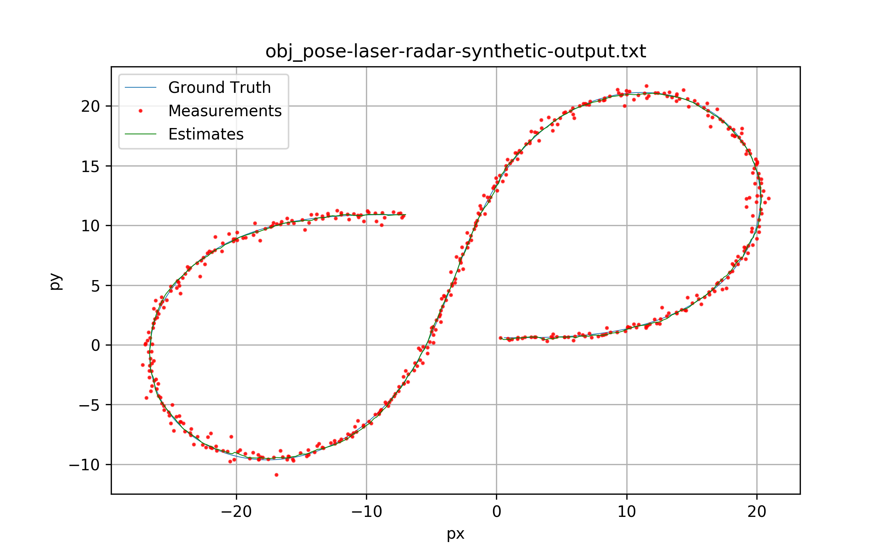
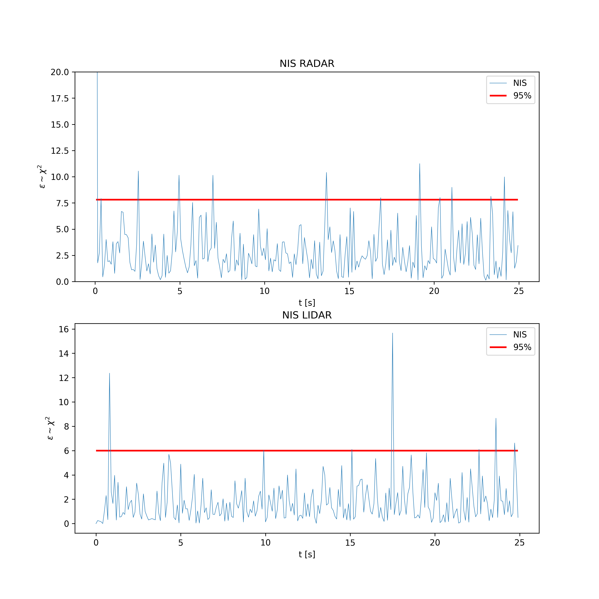

# Unscented Kalman Filter Project
Self-Driving Car Engineer Nanodegree Program

---

The goal of this project is to apply the Unscented Kalman Filter to fuse data from LIDAR and Radar sensors. 

This repository is a fork of the [original project starter code](https://github.com/udacity/CarND-Unscented-Kalman-Filter-Project).

## Contents

| Folder/File | Description | 
|:------------|:------------|
| **src**  | source code for the UKF in C++. |
| **data** | input datasets. |
| **data**/obj_pose-laser-radar-synthetic-input.txt | is the new project dataset. The expected RMSE should be less or equal than .09, .10, .40, .30.
| **results** | Outputs, logs and visualization images. |
| **results**/plot_nis.py | Python script to plot the NIS. |

## Results

These are the results for the following values of the process noise parameters:
	
	std_a_ = 0.5; // m/s^2
	std_yawdd_ = 0.8; // rad/s^2

### obj_pose-laser-radar-synthetic-input.txt:

*RMSE*: 0.0607772, 0.0868509,  0.322878,  0.229244 <= .09, .10, .40, .30.

NIS plots:

---

## Dependencies

* cmake >= v3.5
* make >= v4.1
* gcc/g++ >= v5.4

## Basic Build Instructions

1. Clone this repo.
2. Make a build directory: `mkdir build && cd build`
3. Compile: `cmake .. && make`
4. Run it: `./UnscentedKF path/to/input.txt path/to/output.txt`. You can find
   some sample inputs in 'data/'.
    - eg. `./UnscentedKF ../data/obj_pose-laser-radar-synthetic-input.txt`

## Editor Settings

We've purposefully kept editor configuration files out of this repo in order to
keep it as simple and environment agnostic as possible. However, we recommend
using the following settings:

* indent using spaces
* set tab width to 2 spaces (keeps the matrices in source code aligned)

## Code Style

Please stick to [Google's C++ style guide](https://google.github.io/styleguide/cppguide.html) as much as possible.

## Generating Additional Data

This is optional!

If you'd like to generate your own radar and lidar data, see the
[utilities repo](https://github.com/udacity/CarND-Mercedes-SF-Utilities) for
Matlab scripts that can generate additional data.

## Project Instructions and Rubric

This information is only accessible by people who are already enrolled in Term 2
of CarND. If you are enrolled, see [the project page](https://classroom.udacity.com/nanodegrees/nd013/parts/40f38239-66b6-46ec-ae68-03afd8a601c8/modules/0949fca6-b379-42af-a919-ee50aa304e6a/lessons/c3eb3583-17b2-4d83-abf7-d852ae1b9fff/concepts/f437b8b0-f2d8-43b0-9662-72ac4e4029c1)
for instructions and the project rubric.
